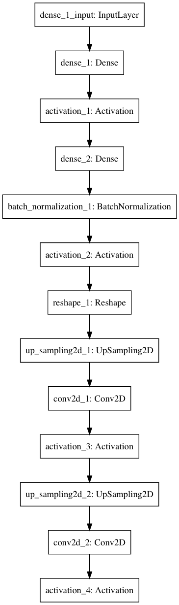
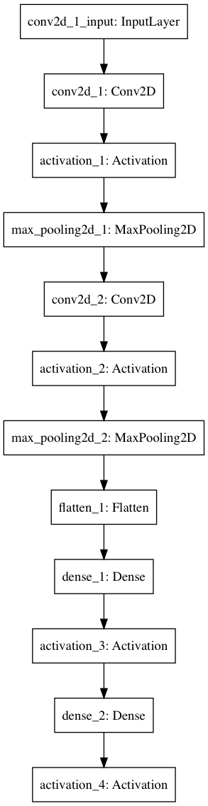

# A Tour of GAN

## 概要
 GANとは, Generative Adversarial Netsの略で, ニューラルネットワークの応用である. ざっくりとした言い方になってしまうが想像しやすいのでネットワークのことを人工知能と呼ぶことにする. generatorとdiscriminatorと呼ばれる2つの人工知能を用意する. generatorは訓練データとできるだけ似ているデータを生成しようとする人工知能で, discriminatorは与えられたデータが訓練データなのかgeneratorが作ったものなのかをできるだけ正確に判別しようとする人工知能だ. 訓練を繰り返す毎にgeneratorは訓練データにより似ているデータを作れるようになり, discriminatorはより厳しく偽物を排除する能力が身につく. 最終的にはgeneratorは訓練データに超似てるを出力することができるようになる. という手法だ.
 

## 対象
1. 上の文章を理解できる程度の人工知能に関する知識を有する者
2. python中級者(pythonはとても可読性が高いのでプログラミング経験者なら大丈夫)
3. kerasを使ったことがある者

## 推奨
上の条件を満たしていない者には下記の記事をおすすめする.
1. [人工知能](https://qiita.com/frost_star/items/21de02ce0d77a156f53d)
2. [python](http://www.tohoho-web.com/python/)
3. [keras](https://keras.io/ja/)

## 写経してみよう!

```python
# -*- coding: utf-8 -*- #

from keras.models import Sequential
from keras.layers import Dense
from keras.layers import Reshape
from keras.layers.core import Activation
from keras.layers.normalization import BatchNormalization
from keras.layers.convolutional import UpSampling2D
from keras.layers.convolutional import Conv2D, MaxPooling2D
from keras.layers.core import Flatten
from keras.optimizers import SGD
from keras.datasets import mnist
import numpy as np
from PIL import Image
import argparse
import math


def generator_model():
    model = Sequential()
    model.add(Dense(input_dim=100, output_dim=1024))
    model.add(Activation('tanh'))
    model.add(Dense(128*7*7))
    model.add(BatchNormalization())
    model.add(Activation('tanh'))
    model.add(Reshape((7, 7, 128), input_shape=(128*7*7,)))
    model.add(UpSampling2D(size=(2, 2)))
    model.add(Conv2D(64, (5, 5), padding='same'))
    model.add(Activation('tanh'))
    model.add(UpSampling2D(size=(2, 2)))
    model.add(Conv2D(1, (5, 5), padding='same'))
    model.add(Activation('tanh'))
    return model


def discriminator_model():
    model = Sequential()
    model.add(
            Conv2D(64, (5, 5),
            padding='same',
            input_shape=(28, 28, 1))
            )
    model.add(Activation('tanh'))
    model.add(MaxPooling2D(pool_size=(2, 2)))
    model.add(Conv2D(128, (5, 5)))
    model.add(Activation('tanh'))
    model.add(MaxPooling2D(pool_size=(2, 2)))
    model.add(Flatten())
    model.add(Dense(1024))
    model.add(Activation('tanh'))
    model.add(Dense(1))
    model.add(Activation('sigmoid'))
    return model


def generator_containing_discriminator(g, d):
    model = Sequential()
    model.add(g)
    d.trainable = False
    model.add(d)
    return model


def combine_images(generated_images):
    num = generated_images.shape[0]
    width = int(math.sqrt(num))
    height = int(math.ceil(float(num)/width))
    shape = generated_images.shape[1:3]
    image = np.zeros((height*shape[0], width*shape[1]),
                     dtype=generated_images.dtype)
    for index, img in enumerate(generated_images):
        i = int(index/width)
        j = index % width
        image[i*shape[0]:(i+1)*shape[0], j*shape[1]:(j+1)*shape[1]] = \
            img[:, :, 0]
    return image


def train(BATCH_SIZE):
    (X_train, y_train), (X_test, y_test) = mnist.load_data()
    X_train = (X_train.astype(np.float32) - 127.5)/127.5
    X_train = X_train[:, :, :, None]
    X_test = X_test[:, :, :, None]
    # X_train = X_train.reshape((X_train.shape, 1) + X_train.shape[1:])
    d = discriminator_model()
    g = generator_model()
    d_on_g = generator_containing_discriminator(g, d)
    d_optim = SGD(lr=0.0005, momentum=0.9, nesterov=True)
    g_optim = SGD(lr=0.0005, momentum=0.9, nesterov=True)
    g.compile(loss='binary_crossentropy', optimizer="SGD")
    d_on_g.compile(loss='binary_crossentropy', optimizer=g_optim)
    d.trainable = True
    d.compile(loss='binary_crossentropy', optimizer=d_optim)
    for epoch in range(100):
        print("Epoch is", epoch)
        print("Number of batches", int(X_train.shape[0]/BATCH_SIZE))
        for index in range(int(X_train.shape[0]/BATCH_SIZE)):
            noise = np.random.uniform(-1, 1, size=(BATCH_SIZE, 100))
            image_batch = X_train[index*BATCH_SIZE:(index+1)*BATCH_SIZE]
            generated_images = g.predict(noise, verbose=0)
            if index % 20 == 0:
                image = combine_images(generated_images)
                image = image*127.5+127.5
                Image.fromarray(image.astype(np.uint8)).save(
                    str(epoch)+"_"+str(index)+".png")
            X = np.concatenate((image_batch, generated_images))
            y = [1] * BATCH_SIZE + [0] * BATCH_SIZE
            d_loss = d.train_on_batch(X, y)
            #print("batch %d d_loss : %f" % (index, d_loss))
            noise = np.random.uniform(-1, 1, (BATCH_SIZE, 100))
            d.trainable = False
            g_loss = d_on_g.train_on_batch(noise, [1] * BATCH_SIZE)
            d.trainable = True
            #print("batch %d g_loss : %f" % (index, g_loss))
            if index % 100 == 0:
                print(100*index/int(X_train.shape[0]/BATCH_SIZE), '%')
            if index % 10 == 9:
                g.save_weights('generator', True)
                d.save_weights('discriminator', True)


def generate(BATCH_SIZE, nice=False):
    g = generator_model()
    g.compile(loss='binary_crossentropy', optimizer="SGD")
    g.load_weights('generator')
    if nice:
        d = discriminator_model()
        d.compile(loss='binary_crossentropy', optimizer="SGD")
        d.load_weights('discriminator')
        noise = np.random.uniform(-1, 1, (BATCH_SIZE*20, 100))
        generated_images = g.predict(noise, verbose=1)
        d_pret = d.predict(generated_images, verbose=1)
        index = np.arange(0, BATCH_SIZE*20)
        index.resize((BATCH_SIZE*20, 1))
        pre_with_index = list(np.append(d_pret, index, axis=1))
        pre_with_index.sort(key=lambda x: x[0], reverse=True)
        nice_images = np.zeros((BATCH_SIZE,) + generated_images.shape[1:3], dtype=np.float32)
        nice_images = nice_images[:, :, :, None]
        for i in range(BATCH_SIZE):
            idx = int(pre_with_index[i][1])
            nice_images[i, :, :, 0] = generated_images[idx, :, :, 0]
        image = combine_images(nice_images)
    else:
        noise = np.random.uniform(-1, 1, (BATCH_SIZE, 100))
        generated_images = g.predict(noise, verbose=1)
        image = combine_images(generated_images)
    image = image*127.5+127.5
    Image.fromarray(image.astype(np.uint8)).save(
        "generated_image.png")


def get_args():
    parser = argparse.ArgumentParser()
    parser.add_argument("--mode", type=str)
    parser.add_argument("--batch_size", type=int, default=128)
    parser.add_argument("--nice", dest="nice", action="store_true")
    parser.set_defaults(nice=False)
    args = parser.parse_args()
    return args

if __name__ == "__main__":
    args = get_args()
    if args.mode == "train":
        train(BATCH_SIZE=args.batch_size)
    elif args.mode == "generate":
        generate(BATCH_SIZE=args.batch_size, nice=args.nice)


```

## 解説
### ■Generatorモデル
#### import
```python
from keras.model import Sequential
from keras.layers import Dense
from keras.layers import Reshape
from keras.layers.core Activation
from keras.layers.normalization import BatchNormalization
from keras.layers.convolutional import UpSampling2D
from keras.layers.convolutional import Conv2D, MaxPooling2D
from keras.layers.core import Flatten
from keras.optimizers import SGD
from keras.datasets import mnist
import numpy as np
from PIL import Image
import argparse
import math
```

|名前|解説|
|:--|:--|
|Sequential|学習モデルのオブジェクトを生成する. そのモデルにレイヤーを追加していく.|
|Dense|全結合層|
|Reshape|形を変更するレイヤー|
|Activation|活性化関数|
|BatchNormalization|活性化関数に渡す前にデータをいい感じにしてくれるやつ.|
|UpSampling2D|同じデータを増やす. これはデータ量を増やす手段としてよく使われる.|
|Conv2D|畳み込み層|
|MaxPooling2D|最大値を取ってくるプーリング層|
|Flatten|1次元のテンソルに変換してくれる.|
|SGD|確率的勾配降下法|
|mnist|手書き文字の画像を大量に提供してくれるデータセット|
|numpy|pythonのライブラリで, 高度な計算を助けてくれる.|
|PIL|画像を色々いじるためのライブラリ|
|argparse|コマンドライン引数を処理するためのモジュール|
|math|数学のいろんな関数等を扱えるpythonの標準ライブラリ|

■BatchNormalization  
Affineレイヤーの後に使うレイヤーでBatch Normalizationの出力は活性化関数に入力する.  
メリット
- 学習係数を大きくしても大丈夫になるので, 学習が早くなる.
- 初期値にそれほど依存しない.
- 過学習を抑制する.

■MaxPooling2D  
プリーング層の一種.  
プーリング層とは, データ量を落とすもの.  
Maxプーリングとは, 画像内のピクセルのうち2×2のピクセルの中で最も高い値の物だけを残すもの.  

■PIL  
PILとは, Python Imaging Libraryの略で画像を編集することができるライブラリ  
(例1)画像をグレースケールに変換して保存.
```python
from PIL import Image

img = Image.open( 'foo.jpg' )
gray_img = img.convert('L')
gray_img.save('gray.jpg')
```

■argparse  
argparseモジュールはpythonの標準ライブラリで, コマンドライン引数を処理するためのモジュールである.  

コマンドライン引数とは,  
コマンドラインからプログラムを実行する際, `python [プログラム名]`というコマンドを入力する. 一方で, `python [プログラム名] [数字など]`という風にプログラム名の後に値を加えると, プログラム上で`sys.argv`というリストに加えられる. このように実行時に値を変更するための機能がコマンドライン引数である.  

(例)コマンドライン引数
```python
import sys

args = sys.argv
print(args)

'''
実行結果
python test.py 12 hoge
>>>['test.py', 12, 'hoge']
'''
```
見てわかる通り, sys.argvリストの0番目の要素にはプログラム名が入っている.  

話をargparseに戻す. argparseはコマンドライン引数をより便利にする機能で, 例えば下のように`--sum`というコマンドライン引数が与えられれば, 他の与えられたコマンドラインを合計を計算するようにプログラムを組むことができる.
```python
import argparse

parser = argparse.ArgumentParser(description='Process some integers.')
parser.add_argument('integers', metavar='N', type=int, nargs='+',
                    help='an integer for the accumulator')
parser.add_argument('--sum', dest='accumulate', action='store_const',const=sum)

args = parser.parse_args()
print(args.accumulate(args.integers))

'''
実行結果
python test.py 1 2 3 4 --sum
>>>10
'''
```

#### モデル
```python
def generator_model():
    model = Sequential()
    model.add(Dense(input_dim=100 output_dim=1024))
    model.add(Activation('tanh'))
    model.add(Dense(128*7*7))
    model.add(BatchNormalization())
    model.add(Activation(tanh))
    model.add(Reshape((7, 7, 128, input_shape=(128*7*7,))))
    model.add(UpSampling2D(size=(2, 2)))
    model.add(Conv2D(64, (5, 5), padding='same))
    model.add(Activation('tanh'))
    model.add(UpSampling2D(size=(2, 2)))
    model.add(Conv2D(1, (5, 5), padding='same))
    model.add(Activation('tanh'))
    return model
```

こんな感じ  





### ■discriminatorモデル
```python
def discriminator_model():
    model = Sequential()
    model.add(
            Conv2D(64, (5, 5),
            padding='same',
            input_shape=(28, 28, 1))
            )
    model.add(Activation('tanh'))
    model.add(MaxPooling2D(pool_size=(2, 2)))
    model.add(Conv2D(128, (5, 5)))
    model.add(Activation('tanh'))
    model.add(MaxPooling2D(pool_size=(2, 2)))
    model.add(Flatten())
    model.add(Dense(1024))
    model.add(Activation('tanh'))
    model.add(Dense(1))
    model.add(Activation('sigmoid'))
    return model
```

こんな感じ  



## 参考記事
### Gan
-[Generative Adversarial Networks(Gan)を勉強して、kerasで手書き文字生成する](http://yusuke-ujitoko.hatenablog.com/entry/2017/05/08/010314)
-[Generative Adversarial Nets](https://arxiv.org/pdf/1406.2661.pdf)

### Batch Normalization
-[Batch Normalizationとは何か](https://deepage.net/deep_learning/2016/10/26/batch_normalization.html)
-[Batch Normalizationの理解](https://qiita.com/t-tkd3a/items/14950dbf55f7a3095600)
-[Batch Normalization: Accelerationg Deep Network Training by Reducing Internal Covariate Shift](https://arxiv.org/abs/1502.03167)
